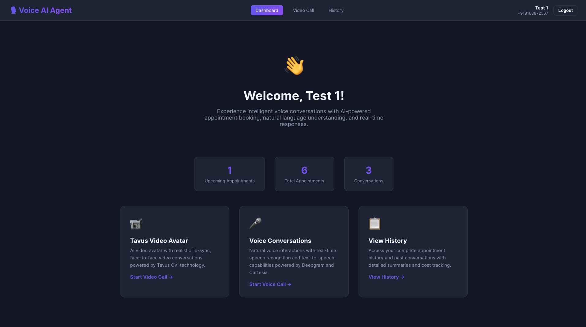
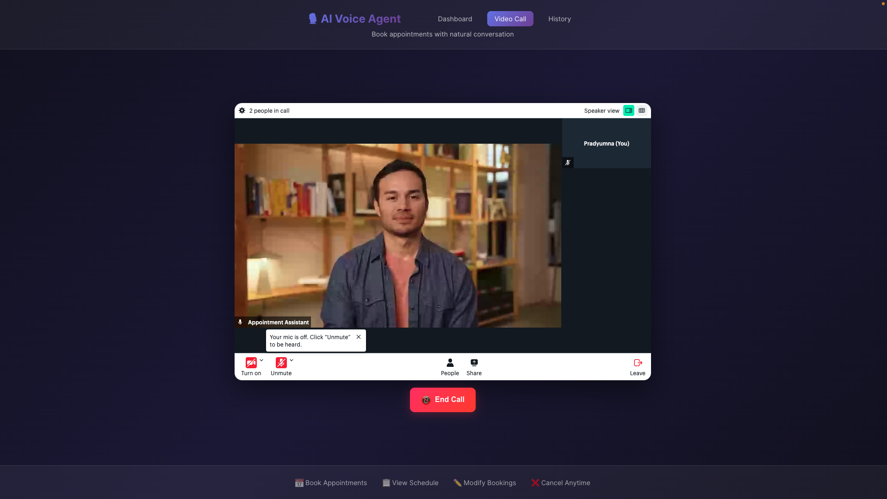
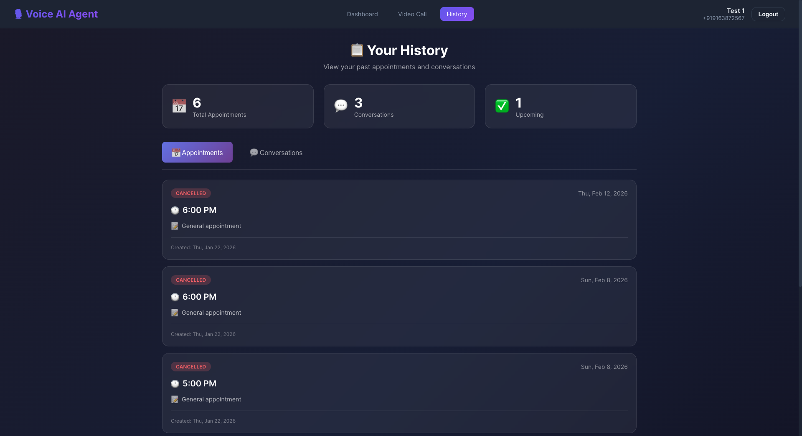
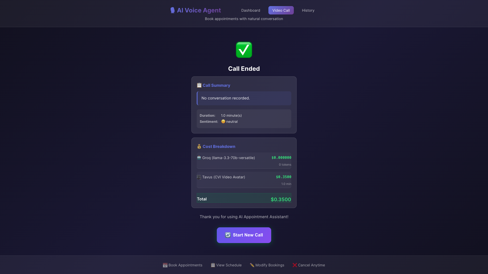

# 🎙️ VoiceAI - AI-Powered Appointment Manager

<div align="center">


**An intelligent voice-first appointment management system with AI video avatar powered by Tavus and Groq LLM**

[](LICENSE)
[](https://www.python.org/)
[](https://reactjs.org/)
[](https://www.docker.com/)

[Features](#-features) • [Architecture](#-architecture) • [Tech Stack](#-tech-stack) • [Quick Start](#-quick-start) • [Deployment](#-deployment) • [API Docs](#-api-documentation)

</div>

---

## 📖 Overview

VoiceAI is a cutting-edge conversational AI application that allows users to manage appointments through natural voice interactions with a realistic video avatar. The system combines advanced language models, real-time video generation, and intelligent tool execution to provide a seamless, human-like appointment booking experience.

### Key Highlights

- 🎥 **Realistic Video Avatar** - Powered by Tavus CVI (Conversational Video Interface)
- 🧠 **Intelligent Conversation** - Uses Groq's LLaMA 3.3 70B for natural language understanding
-  **Cost Tracking** - Tracks LLM tokens and video generation costs per conversation
- 📊 **LLM-Generated Summaries** - Automatic call summaries with sentiment analysis
- 🔐 **Secure Authentication** - JWT-based user authentication
- 📱 **Responsive UI** - Modern React frontend with real-time updates

---

## 🎬 Screenshots

> **How to add screenshots:**
> 1. Create a `docs/images/` directory in the project root
> 2. Take screenshots of your app and save them as PNG/JPG
> 3. Place them in `docs/images/` with descriptive names
> 4. The images will automatically display below

### Dashboard

*Main dashboard showing user stats and quick actions*

### Video Call Interface

*Live conversation with AI avatar - booking an appointment*

### Appointment History

*View all appointments and conversation summaries*

### Call Summary

*Detailed call summary with cost breakdown and sentiment analysis*

---

## ✨ Features

### 🎯 Core Features

- **Natural Voice Conversations** - Speak naturally with the AI avatar to manage appointments
- **Appointment Management**
  - Book new appointments with date, time, and purpose
  - Retrieve upcoming and past appointments
  - Modify existing appointments (date/time/purpose)
  - Cancel appointments with confirmation
- **Video Avatar Integration** - Realistic AI avatar responds with synchronized speech and expressions
- **Context-Aware Conversations** - AI remembers conversation context and user preferences

### 📊 Analytics & Tracking

- **Call Summaries** - LLM-generated summaries after each conversation
- **Cost Breakdown** - Track costs for LLM tokens ($0.59/1M input, $0.79/1M output) and Tavus video ($0.35/min)
- **Sentiment Analysis** - Understand user satisfaction from conversation tone
- **Conversation History** - Review past calls with full details
- **Appointment Analytics** - View total, upcoming, and past appointments

### 🔒 Security & Performance

- JWT authentication with secure token management
- Rate limiting on API endpoints
- PostgreSQL for reliable data storage
- Redis for session and cache management
- Docker containerization for easy deployment

---

## 🏗️ Architecture

### System Architecture Diagram

```
┌─────────────────────────────────────────────────────────────────┐
│                           User Browser                          │
│                      (React + Vite Frontend)                    │
└────────────┬──────────────────────────────────────┬─────────────┘
             │                                      │
             │ HTTP/HTTPS                           │ WebSocket (Tavus SDK)
             │                                      │
┌────────────▼──────────────────────────────────────▼─────────────┐
│                         Nginx Reverse Proxy                      │
│              (Load Balancing + SSL Termination)                  │
└────────────┬──────────────────────────────────────┬─────────────┘
             │                                      │
     /api/*  │                                      │  /*
             │                                      │
┌────────────▼──────────────┐         ┌────────────▼─────────────┐
│      Backend API           │         │      Frontend Static     │
│   (FastAPI + Python)       │         │       (Nginx Serve)      │
│                            │         │                          │
│  ┌──────────────────────┐ │         └──────────────────────────┘
│  │  LLM Proxy           │ │
│  │  (Groq Integration)  │ │
│  └──────────┬───────────┘ │
│             │              │
│  ┌──────────▼───────────┐ │
│  │  Tool Execution      │ │
│  │  - book_appointment  │ │
│  │  - retrieve_appts    │ │
│  │  - modify_appt       │ │
│  │  - cancel_appt       │ │
│  └──────────┬───────────┘ │
└─────────────┼──────────────┘
              │
      ┌───────┴────────┐
      │                │
┌─────▼─────┐    ┌────▼─────┐
│ PostgreSQL│    │  Redis   │
│  Database │    │  Cache   │
└───────────┘    └──────────┘

External Services:
┌─────────────┐    ┌─────────────┐
│   Tavus     │    │    Groq     │
│  Video CVI  │    │  LLM API    │
└─────────────┘    └─────────────┘
```

### Data Flow

```
1. User Interaction Flow
   ┌─────────┐
   │  User   │
   │ Speaks  │
   └────┬────┘
        │
        ▼
   ┌─────────────┐
   │  Tavus SDK  │ ← Captures audio + video
   │  (Browser)  │
   └──────┬──────┘
          │ Sends audio to Tavus
          ▼
   ┌──────────────┐
   │ Tavus Server │ ← Transcribes speech
   └──────┬───────┘
          │ Forwards to custom LLM
          ▼
   ┌───────────────┐
   │  LLM Proxy    │ ← Receives text prompt
   │  (Backend)    │
   └──────┬────────┘
          │
          ▼
   ┌───────────────┐
   │  Groq LLM     │ ← Generates response + tool calls
   │  LLaMA 3.3    │
   └──────┬────────┘
          │
          ▼
   ┌───────────────┐
   │ Tool Parser   │ ← Executes tools (DB operations)
   └──────┬────────┘
          │
          ▼
   ┌───────────────┐
   │  PostgreSQL   │ ← CRUD operations
   └──────┬────────┘
          │
          ▼
   ┌───────────────┐
   │  Response     │ ← Streams back to Tavus
   │  (SSE)        │
   └──────┬────────┘
          │
          ▼
   ┌──────────────┐
   │ Tavus TTS +  │ ← Generates avatar speech/video
   │ Video Avatar │
   └──────┬───────┘
          │
          ▼
   ┌─────────────┐
   │  User sees  │
   │  & hears    │
   └─────────────┘
```

### Component Architecture

```
voiceai/
│
├── frontend/                    # React + Vite Frontend
│   ├── src/
│   │   ├── pages/
│   │   │   ├── Login.jsx       # Authentication
│   │   │   ├── Dashboard.jsx   # Main dashboard
│   │   │   ├── TavusVoiceAgent.jsx  # Video call interface
│   │   │   └── History.jsx     # Conversation history
│   │   ├── services/
│   │   │   └── api.js          # API client with auth
│   │   └── styles/             # CSS modules
│   └── Dockerfile              # Frontend container
│
├── backend/                     # FastAPI Backend
│   ├── app/
│   │   ├── api/
│   │   │   ├── auth.py         # JWT authentication
│   │   │   ├── voice.py        # Voice endpoints
│   │   │   ├── tavus.py        # Tavus integration
│   │   │   └── llm_proxy.py    # LLM proxy with streaming
│   │   ├── services/
│   │   │   ├── cost_tracker.py # Cost calculation
│   │   │   └── tools/
│   │   │       ├── definitions.py  # Tool schemas
│   │   │       └── handlers.py     # Tool execution
│   │   ├── models.py           # SQLAlchemy models
│   │   └── database.py         # DB connection
│   └── Dockerfile              # Backend container
│
├── docker-compose.yml           # Complete stack orchestration
├── nginx.conf                   # Reverse proxy config
├── deploy.sh                    # Automated deployment script
└── .env                         # Environment variables
```

---

## 🛠️ Tech Stack

### Frontend
- **React 18** - UI framework
- **Vite** - Build tool and dev server
- **Tavus SDK** - Video avatar integration
- **React Router** - Client-side routing
- **Axios** - HTTP client

### Backend
- **FastAPI** - High-performance Python web framework
- **SQLAlchemy** - ORM for database operations
- **Pydantic** - Data validation
- **PyJWT** - JSON Web Token authentication
- **Passlib** - Password hashing
- **Redis** - Session and cache storage

### AI & ML
- **Groq Cloud** - LLM inference (LLaMA 3.3 70B)
- **Tavus CVI** - Conversational Video Interface
- **Server-Sent Events (SSE)** - Real-time streaming responses

### Infrastructure
- **PostgreSQL 16** - Relational database
- **Redis 7** - In-memory data store
- **Nginx** - Reverse proxy and load balancer
- **Docker & Docker Compose** - Containerization

### DevOps
- **Docker** - Container runtime
- **Bash** - Deployment automation
- **Git** - Version control

---

## 🚀 Quick Start

### Prerequisites

- Docker 24+ and Docker Compose
- Git
- 4GB RAM minimum
- Groq API key ([Get one here](https://console.groq.com))
- Tavus API key ([Get one here](https://platform.tavus.io))

### Local Development Setup

1. **Clone the repository**
   ```bash
   git clone https://github.com/yourusername/voiceai.git
   cd voiceai
   ```

2. **Create environment file**
   ```bash
   cp .env.example .env
   ```

3. **Edit `.env` file with your credentials**
   ```bash
   nano .env
   ```
   
   Required variables:
   ```env
   GROQ_API_KEY=gsk_your_groq_api_key
   TAVUS_API_KEY=your_tavus_api_key
   TAVUS_REPLICA_ID=your_replica_id
   TAVUS_PERSONA_ID=your_persona_id
   PUBLIC_URL=http://localhost:8000
   ```

4. **Start all services**
   ```bash
   docker compose up -d --build
   ```

5. **Access the application**
   - Frontend: http://localhost
   - Backend API: http://localhost/api
   - API Docs: http://localhost/api/docs

6. **Create a user account**
   - Navigate to http://localhost/login
   - Click "Sign up" and create an account
   - Login and start using the voice agent!

### Development Commands

```bash
# View logs
docker compose logs -f

# Restart a service
docker compose restart backend

# Stop all services
docker compose down

# Rebuild after code changes
docker compose up -d --build

# Access database
docker compose exec postgres psql -U voiceai -d voiceai_db

# Access backend shell
docker compose exec backend bash
```

---

## 🌐 Deployment

### Production Deployment on EC2

Full deployment guide with automated script for AWS EC2 or any VPS.

#### Quick Deploy (One Command)

```bash
# SSH into your EC2 instance
ssh -i your-key.pem ubuntu@your-ec2-ip

# Run deployment script
curl -sSL https://raw.githubusercontent.com/yourusername/voiceai/main/deploy.sh | bash -s -- --full
```

#### Manual Deployment Steps

1. **Clone repository**
   ```bash
   git clone https://github.com/yourusername/voiceai.git
   cd voiceai
   ```

2. **Setup environment**
   ```bash
   cp .env.example .env
   nano .env  # Fill in production values
   ```

3. **Deploy with Docker Compose**
   ```bash
   docker compose up -d --build
   ```

4. **Configure SSL (Optional but recommended)**
   ```bash
   # Install certbot
   sudo apt install certbot
   
   # Get SSL certificate
   sudo certbot certonly --standalone -d yourdomain.com
   
   # Copy certificates
   mkdir -p ssl
   sudo cp /etc/letsencrypt/live/yourdomain.com/fullchain.pem ./ssl/
   sudo cp /etc/letsencrypt/live/yourdomain.com/privkey.pem ./ssl/
   
   # Uncomment HTTPS section in nginx.conf and restart
   docker compose restart nginx
   ```

5. **Open ports in security group**
   - Port 80 (HTTP)
   - Port 443 (HTTPS)
   - Port 22 (SSH)

See [DEPLOYMENT.md](./DEPLOYMENT.md) for detailed deployment documentation.

---

## 📚 API Documentation

### Authentication Endpoints

#### Register User
```http
POST /api/auth/register
Content-Type: application/json

{
  "name": "John Doe",
  "email": "john@example.com",
  "contact_number": "+1234567890",
  "password": "securePassword123"
}
```

#### Login
```http
POST /api/auth/login
Content-Type: application/json

{
  "email": "john@example.com",
  "password": "securePassword123"
}

Response:
{
  "access_token": "eyJ0eXAiOiJKV1QiLCJhbGc...",
  "token_type": "bearer",
  "user": { ... }
}
```

### Tavus Integration Endpoints

#### Start Conversation
```http
POST /api/tavus/start
Authorization: Bearer <token>

Response:
{
  "conversation_url": "https://tavus.io/conversation/...",
  "session_id": "uuid-here"
}
```

#### End Conversation
```http
POST /api/tavus/end
Authorization: Bearer <token>
Content-Type: application/json

{
  "session_id": "uuid-here",
  "duration_seconds": 120
}
```

### LLM Proxy Endpoint

#### Chat Completions (OpenAI-compatible)
```http
POST /api/llm/chat/completions
Content-Type: application/json

{
  "model": "llama-3.3-70b-versatile",
  "messages": [...],
  "stream": true,
  "tools": [...]
}
```

### Tool Functions

The AI can execute these tools during conversations:

1. **book_appointment** - Book a new appointment
2. **retrieve_appointments** - Get user's appointments
3. **modify_appointment** - Change appointment details
4. **cancel_appointment** - Cancel an appointment

Full API documentation available at `/api/docs` (Swagger UI) when running the server.

---

## 🔧 Configuration

### Environment Variables

| Variable | Description | Required | Example |
|----------|-------------|----------|---------|
| `POSTGRES_USER` | Database username | Yes | `voiceai` |
| `POSTGRES_PASSWORD` | Database password | Yes | `securepassword` |
| `POSTGRES_DB` | Database name | Yes | `voiceai_db` |
| `GROQ_API_KEY` | Groq API key for LLM | Yes | `gsk_xxx` |
| `TAVUS_API_KEY` | Tavus API key | Yes | `tavus_xxx` |
| `TAVUS_REPLICA_ID` | Your Tavus replica ID | Yes | `r123abc` |
| `TAVUS_PERSONA_ID` | Your Tavus persona ID | Yes | `p456def` |
| `PUBLIC_URL` | Public URL of your app | Yes | `https://yourdomain.com` |
| `JWT_SECRET` | JWT signing secret | Yes | Generate with `openssl rand -hex 32` |

### Cost Configuration

Current pricing (configured in `backend/app/services/cost_tracker.py`):
- **Groq LLM**: $0.59 per 1M input tokens, $0.79 per 1M output tokens
- **Tavus Video**: $0.35 per minute

---

## 🤝 Contributing

Contributions are welcome! Please follow these steps:

1. Fork the repository
2. Create a feature branch (`git checkout -b feature/amazing-feature`)
3. Commit your changes (`git commit -m 'Add amazing feature'`)
4. Push to the branch (`git push origin feature/amazing-feature`)
5. Open a Pull Request

### Development Guidelines

- Follow PEP 8 for Python code
- Use ESLint for JavaScript/React code
- Write tests for new features
- Update documentation as needed

---

## 📝 License

This project is **proprietary and confidential**. All rights reserved. See the [LICENSE](LICENSE) file for full license terms.

**Usage Restrictions:** This code is provided for viewing and educational purposes only. No permission is granted for commercial, production, or business-critical use.

---

## 🙏 Acknowledgments

- **Tavus** - For providing the amazing video avatar platform
- **Groq** - For fast LLM inference
- **FastAPI** - For the excellent Python web framework
- **React** - For the powerful UI library

---

## 📞 Support

- **Documentation**: [Full docs](./DEPLOYMENT.md)
- **Issues**: [GitHub Issues](https://github.com/yourusername/voiceai/issues)
- **Discussions**: [GitHub Discussions](https://github.com/yourusername/voiceai/discussions)

---

<div align="center">

Made with ❤️ by [Your Name](https://github.com/yourusername)

**[⬆ Back to Top](#-voiceai---ai-powered-appointment-manager)**

</div>
